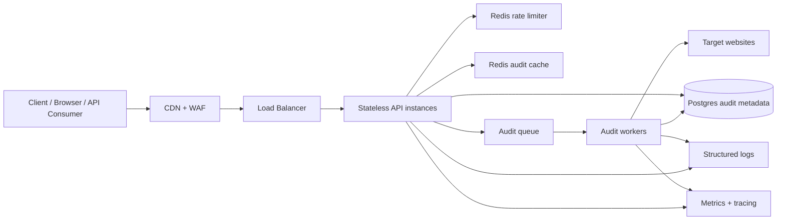

# Architecture Document

## Target

Page Pulse must support 10,000 audits per day, bursts of 500 concurrent requests, and a customer-facing response-time SLA.

## Components

## Architectural Principles

- Keep API instances stateless so they can scale horizontally and be replaced during deploys.
- Treat outbound website fetches as untrusted work with strict timeouts, byte limits, redirect controls, and backpressure.
- Put shared mutable state in managed infrastructure, not process memory.
- Prefer fast cache hits for repeat audits, then bounded synchronous execution, then queueing for bursts.
- Return structured, machine-readable failures so clients can retry or display errors safely.

## Data Flow

1. The client calls `POST /api/audit` with a URL.
2. CDN/WAF applies edge protections and forwards to the load balancer.
3. API validates the URL, attaches a request ID, checks Redis rate limits, and checks Redis cache.
4. Cache hits return immediately.
5. Cache misses either run synchronously if capacity is available or enqueue an audit job when the worker pool is saturated.
6. Workers fetch target pages with timeouts, response-size limits, redirect limits, and HTML-only validation.
7. Results are written to Redis for the configured cache window and optionally to Postgres for history and customer reporting.
8. Logs, metrics, and traces are emitted from API and worker paths with the request ID and job ID.

## Queueing Strategy

Use a bounded queue such as BullMQ on Redis or a managed queue such as SQS. The API should return:

- `200` for fresh synchronous audits and cache hits.
- `202` with a job ID when burst load exceeds the synchronous worker budget.
- `429` when the client exceeds the rate limit.
- `503` when global queue depth or downstream error budgets are exhausted.

This protects the SLA for accepted work while applying backpressure during bursts.

## State

- Redis: cache entries, rate-limit counters, queue coordination.
- Postgres: durable audit records, customer accounts, API keys, historical reporting.
- Object storage: optional raw response samples for debugging, retained briefly and redacted.
- Logs/metrics/traces: centralized observability backend.

## Scaling

Run API and worker deployments independently. API scales on request concurrency and latency. Workers scale on queue depth, job age, timeout rate, and CPU/network utilization. Redis should be a managed HA deployment with eviction policies sized around cache TTL and traffic.

## SLA Strategy

Use two response paths:

- Fast path: validation, rate-limit check, Redis cache lookup, and immediate response for cache hits.
- Work path: synchronous audit only while active worker capacity is below threshold; otherwise enqueue and return `202`.

This keeps API latency stable during bursts. Customers that need guaranteed fresh audits can poll by job ID or subscribe to webhook completion.

## Security Controls

- Reject non-HTTP protocols and private network targets to reduce SSRF risk.
- Enforce outbound request timeouts and response-size limits.
- Use WAF rules and API keys in front of public endpoints.
- Log request IDs and error codes, but avoid storing raw page bodies by default.
